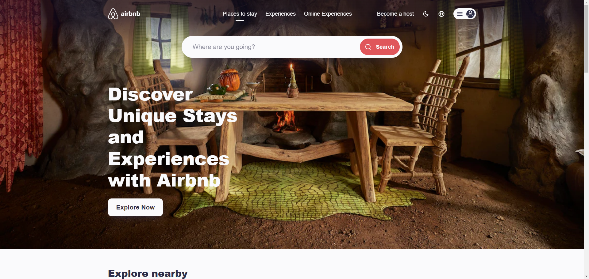

# Airbnb Clone

This project is a responsive clone of the Airbnb landing page, built using Next.js with the latest App Router framework and styled with Styled Components. It adapts seamlessly to both desktop and mobile devices.

## ScreenShot



## Features

- **Next.js App Router**: Utilizing Next.js' latest App Router framework for efficient routing and optimized performance.
- **Styled Components**: All components are styled using Styled Components, allowing for scoped and dynamic styling.
- **Responsive Design**: The UI is fully responsive and adapts to different screen sizes for both desktop and mobile views.
- **Modern Technologies**: Implemented with best practices in web development, ensuring clean and maintainable code.

## Installation

To get started, clone the repository and install the necessary dependencies:

```bash
git clone https://github.com/yourusername/airbnb-clone.git
cd airbnb-clone
npm install
```

## Running the Project

To run the project locally, use the following command:

```bash
npm run dev
```

This will start the development server at [http://localhost:3000](http://localhost:3000).

## Technologies Used

- **Next.js**: A React framework for building server-side rendered and static websites.
- **Styled Components**: A library for styling React components using tagged template literals.
- **Responsive Design**: The app is designed to work on various screen sizes, from mobile to desktop.

## Contributing

Contributions are welcome! Feel free to fork the repository and submit pull requests.

## License

This project is licensed under the GNU General Public License v3.0. You can read more about the terms and conditions of the license in the [LICENSE](LICENSE) file.
